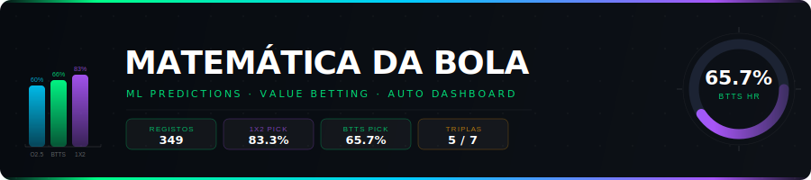

<div align="center">
  
</div>

<br/>

<div align="center">

[](https://github.com/nunovinhas-creator/football-dashboard/actions/workflows/dashboard.yml)&nbsp;
[](https://python.org)&nbsp;
[](https://github.com/nunovinhas-creator/football-dashboard/commits/main)&nbsp;
[](https://hits.seeyoufarm.com)

</div>

<div align="center">

<!-- STATS_START -->
&nbsp;&nbsp;&nbsp;&nbsp;&nbsp;
<!-- STATS_END -->

</div>

<br/>

<div align="center">

**[🌐 Dashboard ao Vivo](https://nunovinhas-creator.github.io/football-dashboard/dashboard.html)&nbsp;&nbsp;·&nbsp;&nbsp;[📊 Backtest & ROI](https://nunovinhas-creator.github.io/football-dashboard/backtest.html)&nbsp;&nbsp;·&nbsp;&nbsp;[⚡ Forçar Update](https://github.com/nunovinhas-creator/football-dashboard/actions/workflows/dashboard.yml)**

</div>

---

## O Que É

**Matemática Da Bola** é um sistema automático de predições quantitativas em futebol. Corre seis vezes por dia via GitHub Actions, sem intervenção humana:

- Busca previsões ML (CatBoost) da BSD API para todos os jogos disponíveis
- Compara probabilidades do modelo com as odds Pinnacle (de-vigged)
- Detecta **value bets** onde a edge ML supera a margem mínima por mercado
- Gera um dashboard HTML interativo e envia alertas Telegram
- Faz backtest automático e calcula ROI em 1X2, BTTS, Over 2.5 e Triplas

Não há frontend framework, não há base de dados, não há servidor. Apenas dois scripts Python + GitHub Pages.

---

## ⚡ Como Funciona

```
BSD API ──┐
           ├──► fetch_all_predictions()  ← pagina todos os dias disponíveis
           │
Pinnacle ──┤──► fetch_odds(event_id)    ← apenas jogos de hoje (performance)
           │
           └──► detect_value()          ← edge > threshold por mercado
                     │
                     ▼
              build_html()  ──►  docs/dashboard.html  ──►  GitHub Pages
                     │
                     └──►  send_telegram()  ──►  Alerta com picks do dia
```

| Passo | O que acontece |
|-------|---------------|
| `fetch_all_predictions()` | Paginação completa da API — devolve todos os dias disponíveis |
| `enrich()` | Odds Pinnacle só para jogos de hoje (evita N×calls para dias futuros) |
| `detect_value()` | `edge = ML prob − Pinnacle fair prob` → flag se `edge > _EDGE_MIN[market]` |
| `build_html()` | HTML self-contained com CSS/JS inline — dark mode, filtros client-side |
| `send_telegram()` | Markdown com picks, odds e confiança para o canal configurado |
| `backtest.py SAVE` | Snapshot diário → `docs/preds_YYYY-MM-DD.json` |
| `backtest.py SCORE` | Compara previsões com resultados reais → atualiza `docs/history.json` |

---

## 📊 Performance ao Vivo

> Dados actualizados automaticamente pelo CI a cada run. Amostra: 349 registos, 16 dias.

<!-- STATS_START -->
&nbsp;&nbsp;&nbsp;&nbsp;&nbsp;
<!-- STATS_END -->

| Mercado | Picks | Hits | Hit Rate | Critério de selecção |
|---------|------:|-----:|---------:|---------------------|
| 1X2 | 12 | 10 | **83.3%** | `best ≥ 61% AND conf == MÉDIA` |
| BTTS | 70 | 46 | **65.7%** | `prob_btts ≥ 61% AND conf ∈ {ALTA, MÉDIA}` |
| Over 2.5 | 75 | 45 | **60.0%** | `xg_total ≥ 2.9 AND conf ∈ {ALTA, MÉDIA}` |
| Triplas | 7 | 5 | **71.4%** | 3 picks BTTS/1X2, máx 1 por liga |

### Value Detection por Mercado

| Mercado | Edge mínimo | Lógica |
|---------|------------|--------|
| 1X2 | `> 7%` | `ML_prob − Pinnacle_fair > 0.07` |
| Over 2.5 | `> 5%` | `ML_prob − Pinnacle_fair > 0.05` |
| BTTS | `> 6%` | `ML_prob − Pinnacle_fair > 0.06` |

---

## 🌐 Dashboard ao Vivo

O dashboard HTML é regenerado automaticamente e publicado via GitHub Pages:

| Página | URL | Conteúdo |
|--------|-----|---------|
| **Dashboard** | [/dashboard.html](https://nunovinhas-creator.github.io/football-dashboard/dashboard.html) | Jogos, predições, value bets, tripla do dia |
| **Backtest** | [/backtest.html](https://nunovinhas-creator.github.io/football-dashboard/backtest.html) | Histórico completo, ROI, calibração, análise xG |

**Features do dashboard:**
- 🌙 Dark mode nativo
- 🔍 Filtros por data, liga, confiança, mercado
- 📐 Cards com probabilidades, xG e score previsto
- 🎯 Tripla diária com odds combinadas
- 📱 Responsivo (mobile-first)
- ⚡ Zero dependências externas (CSS/JS inline)

---

## 🏆 Ligas Cobertas

<table>
<tr>
  <th>Liga</th><th>País</th><th>Época</th><th>Status</th>
</tr>
<tr><td>Premier League</td><td>🏴󠁧󠁢󠁥󠁮󠁧󠁿 Inglaterra</td><td>Ago–Mai</td><td>✅</td></tr>
<tr><td>Championship</td><td>🏴󠁧󠁢󠁥󠁮󠁧󠁿 Inglaterra</td><td>Ago–Mai</td><td>✅</td></tr>
<tr><td>La Liga</td><td>🇪🇸 Espanha</td><td>Ago–Mai</td><td>✅</td></tr>
<tr><td>Bundesliga</td><td>🇩🇪 Alemanha</td><td>Ago–Mai</td><td>✅</td></tr>
<tr><td>Serie A</td><td>🇮🇹 Itália</td><td>Ago–Mai</td><td>✅</td></tr>
<tr><td>Ligue 1</td><td>🇫🇷 França</td><td>Ago–Mai</td><td>✅</td></tr>
<tr><td>Champions League</td><td>🏆 Europa</td><td>Set–Mai</td><td>✅</td></tr>
<tr><td>Europa League</td><td>🏆 Europa</td><td>Set–Mai</td><td>✅</td></tr>
<tr><td>Allsvenskan</td><td>🇸🇪 Suécia</td><td>Abr–Nov</td><td>✅</td></tr>
<tr><td>Eliteserien</td><td>🇳🇴 Noruega</td><td>Abr–Nov</td><td>✅</td></tr>
<tr><td>Veikkausliiga</td><td>🇫🇮 Finlândia</td><td>Abr–Out</td><td>✅</td></tr>
<tr><td>Brasileirão A/B</td><td>🇧🇷 Brasil</td><td>Abr–Dez</td><td>✅</td></tr>
<tr><td>Copa Libertadores</td><td>🌎 América do Sul</td><td>Fev–Nov</td><td>✅</td></tr>
<tr><td>Copa Sudamericana</td><td>🌎 América do Sul</td><td>Fev–Nov</td><td>✅</td></tr>
<tr><td>MLS</td><td>🇺🇸 EUA</td><td>Mar–Nov</td><td>✅</td></tr>
<tr><td>J1 League</td><td>🇯🇵 Japão</td><td>Fev–Nov</td><td>✅</td></tr>
<tr><td>K League 1</td><td>🇰🇷 Coreia do Sul</td><td>Fev–Nov</td><td>✅</td></tr>
<tr><td>Saudi Pro League</td><td>🇸🇦 Arábia Saudita</td><td>Ago–Mai</td><td>⛔ excluída</td></tr>
<tr><td>Chinese Super League</td><td>🇨🇳 China</td><td>Mar–Nov</td><td>⛔ excluída</td></tr>
<tr><td>Suomen Cup</td><td>🇫🇮 Finlândia</td><td>Mar–Out</td><td>⛔ excluída</td></tr>
</table>

> ⛔ Ligas excluídas: xG sistematicamente sobre-estimado ou hit rate < 20% em dados históricos.

---

## 🔧 Stack Técnica

<div align="center">

&nbsp;
&nbsp;


</div>

| Componente | Tecnologia | Porquê |
|-----------|-----------|--------|
| Linguagem | Python 3.12 | Suporte nativo em GitHub Actions, `requests` suficiente |
| CI/CD | GitHub Actions (6×/dia) | Free tier, sem servidor, CRON nativo |
| Hosting | GitHub Pages (`docs/`) | Zero custo, CDN global, HTTPS automático |
| Estado | JSON flat files | Sem base de dados, portável, legível |
| Frontend | HTML/CSS/JS inline | Zero dependências, funciona offline, rápido |
| API dados | BSD API v2 | Predições CatBoost + odds Pinnacle |
| Alertas | Telegram Bot API | Push notifications, markdown, gratuito |

---

## 🚀 Setup em 5 Minutos

<details>
<summary><strong>1. Fork e configurar secrets</strong></summary>

```bash
# 1. Fork este repositório
# 2. Vai a Settings → Secrets and variables → Actions
# 3. Adiciona os seguintes secrets:
```

| Secret | Descrição | Obter em |
|--------|-----------|---------|
| `BSD_API_KEY` | Token BSD API (predições CatBoost) | sports.bzzoiro.com |
| `TG_TOKEN` | Token do Telegram Bot | @BotFather no Telegram |
| `TG_CHAT_ID` | ID do teu chat Telegram | @userinfobot no Telegram |
| `GMAIL_USER` | Email Gmail para relatórios | Gmail settings |
| `GMAIL_APP_PASSWORD` | Google App Password | myaccount.google.com/apppasswords |

</details>

<details>
<summary><strong>2. Activar GitHub Pages</strong></summary>

```
Settings → Pages → Source: Deploy from branch
Branch: main  /  Folder: /docs
```

Dashboard disponível em: `https://{username}.github.io/football-dashboard/dashboard.html`

</details>

<details>
<summary><strong>3. Correr manualmente</strong></summary>

```bash
# Instalar dependências
pip install requests

# Variáveis de ambiente
export BSD_API_KEY="..."
export TG_TOKEN="..."
export TG_CHAT_ID="..."

# Gerar dashboard (docs/dashboard.html)
python dashboard.py

# Gerar backtest (docs/backtest.html)
python backtest.py
```

</details>

---

## 📁 Estrutura do Repositório

```
football-dashboard/
├── dashboard.py                    ← fetch + enrich + value detection + HTML + Telegram
├── backtest.py                     ← snapshot + scoring + trebles + ROI + email
├── CLAUDE.md                       ← instruções de desenvolvimento
├── README.md                       ← este ficheiro (stats auto-actualizados pelo CI)
├── assets/
│   └── banner.svg                  ← banner SVG do README
├── .github/
│   └── workflows/
│       └── dashboard.yml           ← CRON 6×/dia (07:00 12:00 14:00 18:30 21:00 00:00 UTC)
└── docs/                           ← servido via GitHub Pages
    ├── dashboard.html              ← dashboard principal (gerado, não editar)
    ├── backtest.html               ← página de backtest (gerada, não editar)
    ├── history.json                ← histórico cumulativo de picks e resultados
    ├── trebles.json                ← triplas pendentes + histórico + ROI
    └── preds_YYYY-MM-DD.json       ← snapshot diário de predicoes (16+ ficheiros)
```

---

## 🕐 Calendário CI/CD

| Hora UTC | Acção | O que faz |
|----------|-------|-----------|
| `07:00` | SAVE + Email | Snapshot predicoes, email diário se configurado |
| `12:00` | SAVE | Snapshot predicoes (mercados asiáticos abertos) |
| `14:00` | SAVE | Snapshot predicoes |
| `18:30` | SAVE + Telegram | Snapshot + alerta antes da janela europeia |
| `21:00` | SAVE | Snapshot final do dia |
| `00:00` | SCORE | Resultados reais → scoring → ROI → backtest.html |

---

## 🗺️ Roadmap

- [x] Predições 1X2, BTTS, Over 2.5, xG
- [x] Value detection vs Pinnacle (de-vigged)
- [x] Tripla diária automática com gestão de bankroll
- [x] Backtest com histórico cumulativo
- [x] Alertas Telegram
- [x] Dashboard multi-dia (filtro por data)
- [x] Análise de calibração + overconfidence
- [x] Stats auto-actualizadas no README via CI
- [ ] Sistema de staking Kelly Criterion
- [ ] Histórico de value picks com ROI separado
- [ ] Exportação CSV/XLSX do histórico

---

<div align="center">

**Matemática Da Bola** · Automação quantitativa para apostas desportivas

*Predições por BSD API · Odds por Pinnacle · Alojado em GitHub Pages*

[](https://github.com/nunovinhas-creator/football-dashboard/stargazers)

</div>
